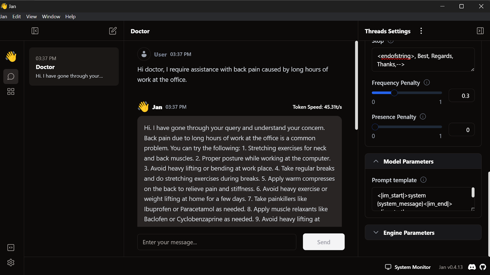

# Fine-Tuning Llama 3 and Using It Locally
## In this project Llama 3 is fine tuned on a dataset of patient-doctor conversations, to create a model for medical dialogue. 
After merging, converting, and quantizing the model, it will be ready for private local use via the Jan application.

The model can also be deployed and used as a WebApp

